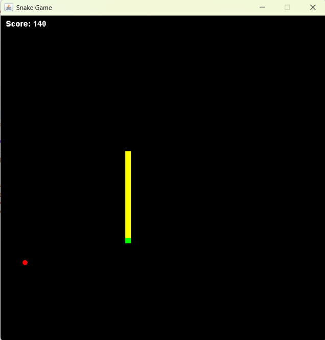
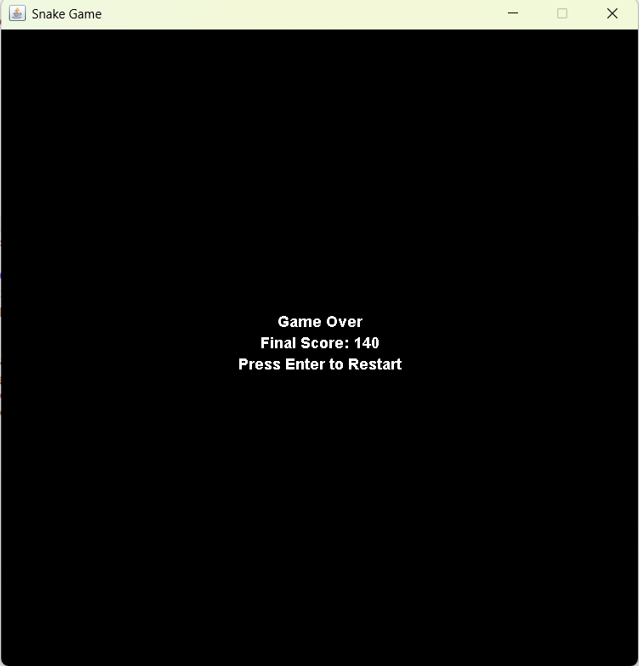

# 🐍 Snake Game in Java

A classic Snake Game built with Java Swing. This project demonstrates GUI design, game logic, keyboard control handling, and object-oriented programming principles in Java.

- ✅ Real-time movement using keyboard arrows
- ✅ Collision detection and score tracking
- ✅ Pause/Resume with `P` key
- ✅ Restart game on `Enter`
- ✅ Simple graphics with `JPanel` and `Timer`

## 🎮 How to Play

- Use ⬅️ ➡️ ⬆️ ⬇️ to move
- Press `P` to pause/resume
- Press `Enter` to restart after Game Over

## 🧠 Technologies Used

| Technology | Purpose |
|------------|---------|
| Java       | Core language |
| Java Swing | GUI and rendering |
| OOP        | Game state, behavior, and logic |
| Timer      | Game loop and animation |
| KeyAdapter | Handling real-time keyboard inputs |

---

## 📸 Screenshot

## 📸 Screenshots

